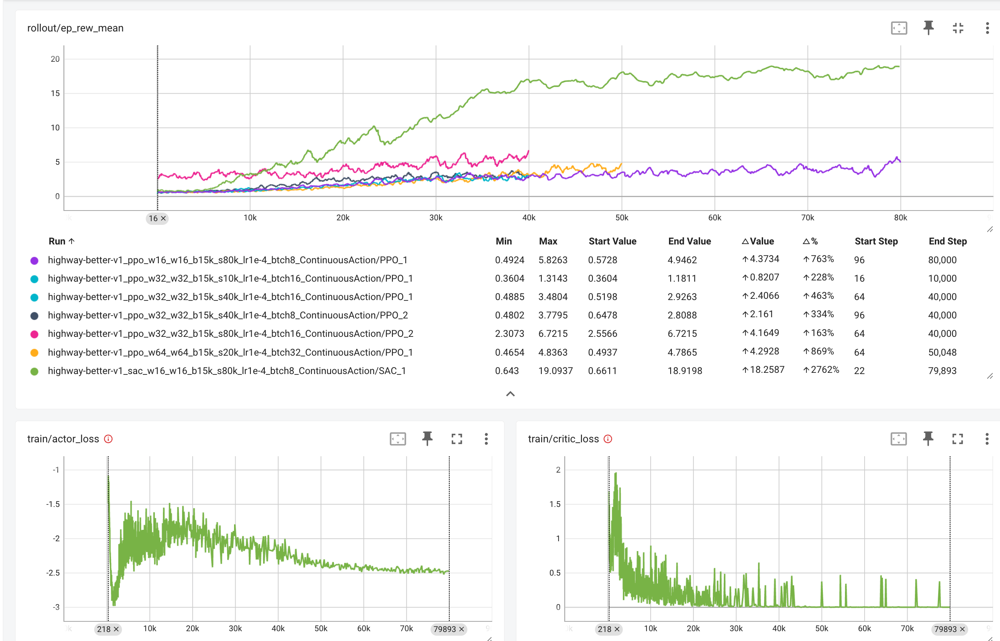

# UW ECE 457C Spring 2025 - Assignment 3 Discussion
# The Highway Environment
As described in the assignment, we'll be using the HighwayEnv library from the Farama foundation for assignment 3. I've listed three environments for you to use, but I was also a bit vague about the setup. So, I'll put some notes and further thoughts here as we get into it.
Essentially there are *lots* of parameters we can adjust to make these environments more interesting. The three I picked are in the default setting: `Highway` (straight piece of road), `Intersection` (a simple four way intersection), and `Racetrack` (a curvy Formula 1 style track with two lanes and multiple cars)

But these defaults have some issues which make then less than ideal for comparison. For the assignment the base required work is to get some RL algorithms working on the three environments.
But for full points, and for learning interest, it is worthwhile considering how to make the environments a bit more interesting.

### Short list of issues
- **Highway**
	
	- [ActionSpace](https://highway-env.farama.org/actions/) - the default is `DiscreteMetaAction` which is a very nice compromise between simplifying the action space enough to allow a classification-type policy like **DQN** to work, and the complexity of a continuous action space.
		- actions are setup so that at each timestep the agent just needs to decide 
		- If you try to train **PPO** (which can handle discrete or continuous actions) on `highway-v0` it will do well, because it just needs to pick the right action class
		  ```json
		  ACTIONS_ALL = {
			0: 'LANE_LEFT',
			1: 'IDLE',
			2: 'LANE_RIGHT',
			3: 'FASTER',
			4: 'SLOWER'
		  }
		  ```
    - `Continuous Action` - this defines the action as a continuous typle for  steering angle and acceleration at each time-step.
	- **Reward Model** - doesn't give enough guidance on how to drive in an interesting way
	- encourages moving to right lane, playing it safe
	- doesn't penalize problematic behaviours when `ActionSpace=ContinuousActions`
# Straight Highway with DiscreteMetaAction'
DQN and PPO do fine when using the `DiscreteMetaAction` default.


## Experiment: `highway-fast_dqn_w64_w64_b15k_s20k_lr5e-4`
drives great! changes lanes well. some rear end crashes


## Experiment: `highway-fast_ppo_w64_w64_b15k_s100k_lr5e-4`

PPO seems to do better, still some crashes.


## Experiment `highway-fast-v0_a2c_w32_w32_b15k_s20k_lr5e-4_DiscreteMetaAction`

A2C even less crashes (*it's a bit boring though...*)

<video src="../../../HighwayEnv/experiments/highway-fast-v0_a2c_w32_w32_b15k_s20k_lr5e-4_DiscreteMetaAction/highway-fast-v0_a2c_w32_w32_b15k_s20k_lr5e-4_DiscreteMetaAction.mov"></video>


# Straight highway with Continuous Actions
- DQN can't do it, by definition.
- PPO has...issues.

## highway-fast-v0_ppo_w64_w64_b15k_s100k_lr1e-4_ContinuousAction
- Staying on the road...
### highway-fast-v0_ppo_w64_w64_b15k_s100k_lr1e-4_nepoch3_ContinuousAction
- spinning?
## Why Does this Happen?
Consider the **reward model**.

- spinning boat example: [Coast Runners Game](https://www.google.com/search?q=dqn+boat+circles+rl+reward&num=10&sca_esv=c84d58b8500b5299&udm=7&biw=1272&bih=958&sxsrf=AE3TifORVbkySaH9qhTOy71p838dIVgm_g%3A1750428153828&ei=-WlVaIKnMqjep84PybGbqAE&ved=0ahUKEwjCh8GClYCOAxUo78kDHcnYBhUQ4dUDCBA&uact=5&oq=dqn+boat+circles+rl+reward&gs_lp=EhZnd3Mtd2l6LW1vZGVsZXNzLXZpZGVvIhpkcW4gYm9hdCBjaXJjbGVzIHJsIHJld2FyZDIFECEYoAEyBRAhGKABMgUQIRigAUj4RlCDE1i_RXACeACQAQCYAXWgAZsIqgEDOS4yuAEDyAEA-AEBmAINoALGCMICCBAAGKIEGIkFwgIEECMYJ8ICCBAAGIAEGKIEwgIFEAAY7wXCAgcQIRigARgKmAMAiAYBkgcDOS40oAftKLIHAzcuNLgHwQjCBwUzLjkuMcgHGA&sclient=gws-wiz-modeless-video#fpstate=ive&vld=cid:84ca1526,vid:tlOIHko8ySg,st:0)
- what about our reward model? 


# A Modified HighwayEnv
I made an updated version of the Highway straight road environment trying to make continuous learning with PPO more feasible.

## Modified Observations and Actions
First I modified a few aspects of the [observations](https://highway-env.farama.org/actions/) that the agent can see. By default they get the Kinematics view with absolute values. 
- I added `heading` which give the direction the vehicle is travelling in *radians*, which means `heading=0` would be facing to the right and going straight. 
- I also added  `lat_off` which is a measure of distance to the nearest lane.

For continuous control one of the main issues with PPO on the default domain is spinning, or over turning. Eventually an algorithm can learn to adjust for this. But since we know that this action is never that useful in this environment we could change the action itself to have a narrower range. 
*Questions: Will this lead to any problems later on? Is it applicable to a more curvy environment like `racetrack`?*

Note that you can also adjust the actions for most environments to enable/disable `lateral` (sideways steering) or `longitudinal` (front and back acceleration) actions. In `intersection`, for example, lateral actions aren't even available, it's all about adjusting speed.

```python
	"observation": {
		"type": "Kinematics",
		"vehicles_count": 40,
		"features": ["presence", "x", "y", "vx", "vy", "heading", "lat_off"],
		"absolute": False
	},
	"action": {
		"type": "ContinuousAction",
		"longitudinal": True,  # Allow longitudinal control
		"acceleration_range": [-1, 1],  # Acceleration range for longitudinal control
		"steering_range": [-.1, .1],  # Steering range for lateral control
		"lateral": True,  # Allow lateral control
		"speed_range": [0, 40]  # Target speeds for longitudinal control
	}
```

## Modified Rewards
As someone asked in class recently: "Would the behaviour change if we adjusted the reward function?"

The answer, without any context, for all time, is **yes**. 
Followup question, is it a good idea to adjust the reward function? *maybe? it depends.*

But it's always worth considering. The reward function **is the real objective** for the agent. It is the only thing that matter for it's greedy, optimizing self. So getting the reward function "right" is very important, and impossible in general. This is because it is *subjective* and it comes down to the fundamental goals and objectives you want the agent to learn. Do you **handhold your agent**, giving it very detailed rewards for all the things you *think* it needs to do? Or do you **provide a more open-ended objective** that doesn't bias the agent about *how* to solve the problem, only informing it what a good (or bad) solution *looks like*?


# Experiments:  `highway-better-v1` with PPO using Various Parameters

- Note that the **green line** is doing well by some measures with `batch size=8` and `width=32` on the smaller side than the others.
### 40k Steps
It has now mastered nudging cars aside, staying in the middle and slowing down to a stop to minimize bad penalties.


### 80k steps
Continuing training for another 40k steps. It has now mastered nudging cars aside, staying in the middle and slowing down to a stop to minimize bad penalties.
- Note the *nudge* in run 2
- Multiple runs end with slowing down to a near stop once the cars are gone.
- 


### Now Try A Simpler model

Added the green line with setup `highway-better-v1_ppo_w16_w16_b15k_s80k_lr1e-4_btch8_ContinuousAction`
Note that the red line is a continuation of the blue up to 80k steps.

So looking at just the rewards, `batch-size=8` does not seem to be doing better than the models with larger networks and training batches. 
But we'd need more evidence to be sure.

#### Observations from Video
Here's the video of 5 runs with the new policy.

- So it seems to try to drive straight and lean and to find itself in the middle of a lane quite well.
- But it still does the slowing down trick, that staying away from other cars entirely is the best way to maximize reward. 
- It's very good at not going off the road entirely and it really seems to be trying to get into Elaine and drive straight.
- **(interesting)** It also does really well navigating a complicated traffic situation in the fourth run around `time=2:40`, weaving between the cars without hitting.
- It has no concept of going exactly straight for multiple steps, it also weaves a bit, that is a side-effect of the continuous action space, even though it is limited to a .5 steering change each step, 0 is just on point like any other in that range. *how could we make zero, or maintain-current-course a special kind of action?*

# Experiments:  `highway-better-v1` with SAC using
Now we try the SAC algorithm instead of PPO but still with the updated environment with continuous actions. We can see immediately that the algorithm stabilizes towards longer survival on the road and higher rewards than any previous algorithm.

### Observations from Video
So on the SAC algorithm watching the video now. This learned much faster if you see the reward functions. When we watch the video we see that it mastered the trick of slowing down and even coming to a full stop on the highway this is no more new cars arrive. This indicates a flaw in the reward function or in the complexity of the domain. 

(Hopefully?) Once we see a trickier situation where I can't avoid the cars we can observe that this algorithm is actually much better in navigating traffic.

#### Slow Strategy for the Win!?


It is even kinda passive aggressive about it, refusing to speed up and waiting for the other car to slide past.


## What about A2C?

It learned to slow down even faster.


# So...What's Next?

